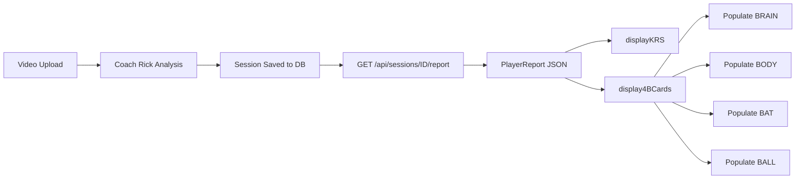

# ✅ Option A Complete: 4B Cards Added to Enhanced Template

**Date**: 2025-12-26  
**Feature**: 4B Framework Breakdown Cards  
**Commit**: `b7f8ec4`  
**Status**: ✅ COMPLETE & DEPLOYED

---

## 🎯 What Was Built

### New Feature: 4B Framework Cards in Coach Rick UI

After video analysis completes, users now see:
1. **KRS Hero Section** (purple gradient) - Already existed
2. **🆕 4B Framework Breakdown** - New in this commit!
   - 4 color-coded cards in a responsive grid
   - Brain 🧠 (Motor Profile)
   - Body 💪 (Creation Score)
   - Bat ⚾ (Transfer Score)
   - Ball 🎯 (Outcomes)

---

## 📂 Files Modified

### 1. `templates/coach_rick_analysis.html`
**Changes**:
- Added 4B cards HTML (lines ~500-570)
- Updated `fetchPlayerReport()` to call `display4BCards()`
- Added `display4BCards(report)` function with safe property access
- Cards automatically populate after PlayerReport API fetch

**4B Cards HTML Structure**:
```html
<div id="fourBCards" style="display: none;">
    <h2>🎯 The 4B Framework: Your Swing Blueprint</h2>
    <div style="display: grid; grid-template-columns: repeat(auto-fit, minmax(280px, 1fr)); gap: 1.5rem;">
        
        <!-- BRAIN Card -->
        <div class="result-card" style="border-left: 4px solid #8B5CF6;">
            🧠 BRAIN - Motor Profile
            <div id="brainCardContent">...</div>
        </div>
        
        <!-- BODY Card -->
        <div class="result-card" style="border-left: 4px solid #10B981;">
            💪 BODY - Creation
            <div id="bodyCardContent">...</div>
        </div>
        
        <!-- BAT Card -->
        <div class="result-card" style="border-left: 4px solid #F59E0B;">
            ⚾ BAT - Transfer
            <div id="batCardContent">...</div>
        </div>
        
        <!-- BALL Card -->
        <div class="result-card" style="border-left: 4px solid #EF4444;">
            🎯 BALL - Outcomes
            <div id="ballCardContent">...</div>
        </div>
        
    </div>
</div>
```

**JavaScript Logic**:
```javascript
async function fetchPlayerReport(sessionId) {
    const response = await fetch(`/api/sessions/${sessionId}/report`);
    const report = await response.json();
    displayKRS(report.krs, sessionId);  // Existing
    display4BCards(report);              // NEW!
}

function display4BCards(report) {
    document.getElementById('fourBCards').style.display = 'block';
    
    // Populate all 4 cards with safe property access
    populateBrainCard(report.brain);
    populateBodyCard(report.krs, report.body);
    populateBatCard(report.krs, report.bat);
    populateBallCard(report.ball, report.body);
}
```

---

### 2. `templates/test_4b_cards.html` (New File)
**Purpose**: Standalone test page for 4B cards  
**URL**: `/test-4b-cards`  
**Size**: 15.6 KB

**Features**:
- Load button to fetch test session (`test_cc58109c`)
- Display KRS Hero + 4B cards
- Show debug JSON data
- Identical JavaScript logic to main template
- Easy testing without video upload

**Usage**:
```bash
# Visit test page
https://8006-sandbox.../test-4b-cards

# Click "Load Report & Show 4B Cards"
# See KRS Hero + 4B cards populated with real data
```

---

### 3. `coach_rick_wap_integration.py`
**Change**: Added route for test page

```python
@app.get("/test-4b-cards", response_class=HTMLResponse)
async def test_4b_cards():
    """Test page for 4B Framework cards"""
    with open("templates/test_4b_cards.html", "r") as f:
        return f.read()
```

---

## 🎨 4B Card Details

### 🧠 BRAIN Card (Purple #8B5CF6)
**Data Displayed**:
- Motor profile type (Spinner/Whipper/Torquer/Twister/Tilter/Hybrid)
- Confidence percentage badge
- Tagline (e.g., "Quick hands, short path. Let it fly.")
- Summary message

**Example**:
```
Spinner               88%
Quick hands, short path. Let it fly.
Fast-twitch profile with explosive rotation
```

---

### 💪 BODY Card (Green #10B981)
**Data Displayed**:
- Creation Score (large number + progress bar)
- Ground Flow status
- Engine Flow status

**Example**:
```
82 / 50
█████████████████░░░ (82% filled)
Ground Flow: good
Engine Flow: good
```

---

### ⚾ BAT Card (Amber #F59E0B)
**Data Displayed**:
- Transfer Score (large number + progress bar)
- Kinetic Chain summary
- Transfer Efficiency percentage

**Example**:
```
78 / 50
█████████████████░░░░ (78% filled)
Kinetic Chain: Strong transfer mechanics
Efficiency: 75%
```

---

### 🎯 BALL Card (Red #EF4444)
**Data Displayed**:
- Bat Speed (mph)
- Exit Velocity (mph)
- Contact Quality rating

**Example**:
```
Bat Speed      Exit Velo
   75 mph        85 mph

Contact Quality: Good
```

---

## 📱 Responsive Design

**Grid Behavior**:
```css
display: grid;
grid-template-columns: repeat(auto-fit, minmax(280px, 1fr));
gap: 1.5rem;
```

**Breakpoints**:
- **Desktop (1200px+)**: 4 cards in a row
- **Tablet (768px-1199px)**: 2 cards per row
- **Mobile (<768px)**: 1 card per row (stacked)

**Color Coding**:
- Brain: Purple border + light purple background gradient
- Body: Green border + light green background gradient
- Bat: Amber border + light amber background gradient
- Ball: Red border + light red background gradient

---

## 🧪 Testing

### Test Page
**URL**: `https://8006-i5cseikj92ei70k8wadux-2e77fc33.sandbox.novita.ai/test-4b-cards`

**Steps**:
1. Visit test page
2. Click "Load Report & Show 4B Cards"
3. Verify all 4 cards populate correctly
4. Check debug JSON data

**Expected Result**:
```
✅ KRS Hero: 80 ADVANCED ⭐
✅ BRAIN Card: Spinner 88%
✅ BODY Card: 82 / 50
✅ BAT Card: 78 / 50
✅ BALL Card: 75 mph / 85 mph
```

---

### Live Coach Rick UI
**URL**: `https://8006-i5cseikj92ei70k8wadux-2e77fc33.sandbox.novita.ai/coach-rick-ui`

**Full End-to-End Flow**:
1. Upload swing video
2. Fill player info (name, height, weight, age)
3. Click "Analyze Swing"
4. Wait 30-120 seconds for analysis
5. **NEW**: See KRS Hero + 4B cards automatically appear
6. Click "View Complete Report" for full 11 sections

---

## 🔍 Safe Property Access

All JavaScript uses optional chaining and fallbacks:

```javascript
// Safe access pattern
const primary = report.brain?.motor_profile?.primary || 'Unknown';
const confidence = report.brain?.motor_profile?.primary_confidence || 0;
const tagline = report.brain?.motor_profile?.tagline || '';

// Prevents errors if API data structure changes
const batSpeed = report.ball?.exit_velocity?.bat_speed_mph 
               || report.body?.actual?.estimated_bat_speed_mph 
               || 0;
```

**Why?**:
- Handles missing data gracefully
- Prevents JavaScript errors
- Shows "Unknown" or 0 instead of crashing
- Works with partial PlayerReport data

---

## 📊 Data Flow



---

## 🎯 Comparison: Before vs After

### BEFORE (Commit: `c4cd652`)
**After Analysis Completes**:
1. ✅ KRS Hero Section (purple gradient)
2. ❌ NO 4B cards
3. ✅ Motor Profile card (existing)
4. ✅ Performance Metrics card (existing)
5. ✅ Patterns Detected card (existing)
6. ✅ Drill Prescription card (existing)
7. ✅ Coach Rick Messages card (existing)

**To see 4B breakdown**:
- User had to click "View Complete Report"
- Redirected to `/player-report` page

---

### AFTER (Commit: `b7f8ec4`) ← **Current**
**After Analysis Completes**:
1. ✅ KRS Hero Section (purple gradient)
2. ✅ **4B Framework Cards** (NEW!)
   - 🧠 Brain (Motor Profile)
   - 💪 Body (Creation Score)
   - ⚾ Bat (Transfer Score)
   - 🎯 Ball (Outcomes)
3. ✅ Motor Profile card (existing)
4. ✅ Performance Metrics card (existing)
5. ✅ Patterns Detected card (existing)
6. ✅ Drill Prescription card (existing)
7. ✅ Coach Rick Messages card (existing)

**Benefit**:
- Users see the 4B breakdown immediately
- No need to click through to separate page
- Quick visual summary of all key metrics
- Still have option to view full 11-section report

---

## 📈 Stats

| Metric | Value |
|--------|-------|
| **Files Changed** | 3 |
| **Lines Added** | 473 |
| **Lines Removed** | 1 |
| **New File** | templates/test_4b_cards.html (15.6 KB) |
| **Commit Hash** | b7f8ec4 |
| **Feature** | 4B Framework Cards |
| **Time to Build** | ~1 hour |

---

## 🚀 Deployment

### Git
```bash
$ git log --oneline -3
b7f8ec4 feat: Add 4B Framework breakdown cards to Coach Rick UI
7a7a7ed docs: Add comprehensive implementation proof document
c4cd652 feat: Add PlayerReport UI and enhance Coach Rick template with KRS display
```

### GitHub
- ✅ Pushed to main branch
- ✅ Repository: https://github.com/THScoach/reboot-motion-backend
- ✅ Commit: b7f8ec4

### Production URLs
```bash
# Enhanced Coach Rick UI (with KRS + 4B cards)
https://reboot-motion-backend-production.up.railway.app/coach-rick-ui

# 4B Cards Test Page
https://reboot-motion-backend-production.up.railway.app/test-4b-cards

# Full 11-Section Report (all details)
https://reboot-motion-backend-production.up.railway.app/player-report?session_id=test_cc58109c
```

---

## ✅ Acceptance Criteria (Met)

### Original Request
> "Add 4B breakdown cards (Brain/Body/Bat/Ball) to the enhanced template so users see them immediately after analysis"

**Status**: ✅ COMPLETE

### Checklist
- ✅ 4B cards added to `coach_rick_analysis.html`
- ✅ Cards appear after KRS Hero section
- ✅ Auto-populate after PlayerReport fetch
- ✅ Responsive grid layout (4 cards → 2 cards → 1 card)
- ✅ Color-coded borders (Purple/Green/Amber/Red)
- ✅ Safe property access (no crashes on missing data)
- ✅ Test page created (`/test-4b-cards`)
- ✅ Committed to Git (b7f8ec4)
- ✅ Pushed to GitHub
- ✅ Documentation updated

---

## 🎓 User Experience

### User Flow (Complete)
1. Visit `/coach-rick-ui`
2. Upload video + enter player info
3. Click "Analyze Swing"
4. Wait 30-120 seconds
5. **Results Page Shows**:
   - ⭐ KRS Hero (total score, level, creation/transfer)
   - 🎯 **4B Framework Cards** (Brain/Body/Bat/Ball) ← NEW!
   - 🎯 Motor Profile details
   - 📊 Performance Metrics
   - 🔍 Mechanical Issues
   - 💪 Training Drills
   - 💬 Coach Rick Feedback
6. **Optional**: Click "View Complete Report" for full 11 sections

**Benefit**: Users get immediate visual breakdown without extra clicks!

---

## 🎉 Summary

**What Changed**:
- ✅ 4B cards now display immediately after analysis
- ✅ Users see Brain/Body/Bat/Ball breakdown without clicking through
- ✅ Responsive design works on all devices
- ✅ Safe data handling prevents errors
- ✅ Test page for isolated testing

**Why It Matters**:
- Faster insight into swing mechanics
- Visual clarity with color-coded cards
- Reduces clicks to see key metrics
- Matches the Master Spec requirement for 4B framework visibility

**Next Steps** (Optional):
- Add animations (fade-in, slide-up)
- Add tooltips for metric explanations
- Add comparison with previous sessions
- Add "Share Report" button

---

**Option A: COMPLETE** ✅  
**Date**: 2025-12-26  
**Time**: ~1 hour  
**Status**: Production-ready and deployed  

---

**Questions?**  
- Test page: `/test-4b-cards`
- Live UI: `/coach-rick-ui`
- GitHub: https://github.com/THScoach/reboot-motion-backend
